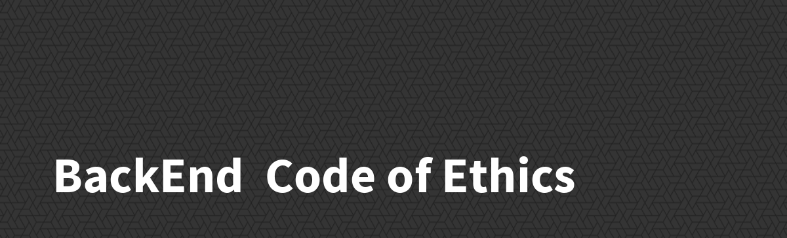

# RoQay Development Team Code of Ethics

1- Always communicate.  
2- Always be online on Teams .  
3- Follow the git-flow principles  https://www.atlassian.com/git/tutorials/comparing-workflows/gitflow-workflow.  
4- Don't hesitate to review other people's work. I always welcome criticism. 
5- Always get your PR code reviewed by somebody else.  
6- Please do not self-merge unless seriously needed (like a critical bug that needs to be deployed ASAP). 
7- Always keep your PR up to date. Rebase frequently. 
8- We love screenshots of work, share with us what you are working on. It helps the code reviewer understand your work better. 
9- Follow PHP/LARAVEL best practices.  
10- Follow PHP style guides https://www.php-fig.org/psr/psr-2/  
11- Be consistent with other people's way of doing things but feel free to discuss improvements.  
12- Always be testing. We don't require 100% test coverage but we do take testing really seriously.  
13- If you can't immediately write a test for a method, make sure to still write a test case and just put pending 'explain the reason why so you or somebody else can return to it later.  
14- We don't need our code to have a lot of comments. Good code is like a good joke, it doesn't need an explanation. Make your code readable instead.  
15- We put more weight on code clarity.  
16- We love metaprogramming but stop metaprogramming just for the sake of doing it without any added value. Again, code clarity.  
17- Make use of special ANNOTATIONS like # TODO:, FIXME:, OPTIMIZE: so rake notes can pick it up.  
18- Found a bug? Do not wait. File immediately on GitHub issues! We get notified instantly anyway.  

`
**When in doubt, ask on Teams.
Prevent being a blocker to your teammates.
Bonus points for being proactive.
Finally, be a good teammate.`**