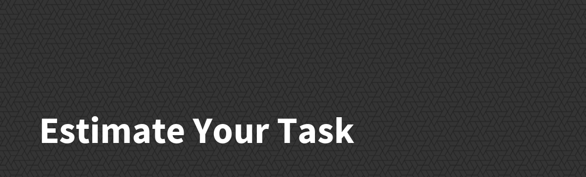

# CheckList for Estimating Your Task

- [ ] How Many Screen ? 
- count your task screen .
 

- [ ] How many Functions ?
- count your task functions and how it impacts your system .
 

- [ ] How Many Changes In Database ?
- count your task changes in database.
 

- [ ] Test Coverage ? _`20% - 30%`_  
- should we make test coverage?

- [ ] How Many risk buffer ?_`5% - 10%`_ 
- take care of tasks you don't count and any wrong estimated tasks.

- [ ] How Many Time Eaters  ?_`5% - 10%`_
- take care for wasted time and non task related time.

- [ ] How Many Bugs ?_`5% - 10%`_
- take care for bugs and any wrong estimated tasks.

